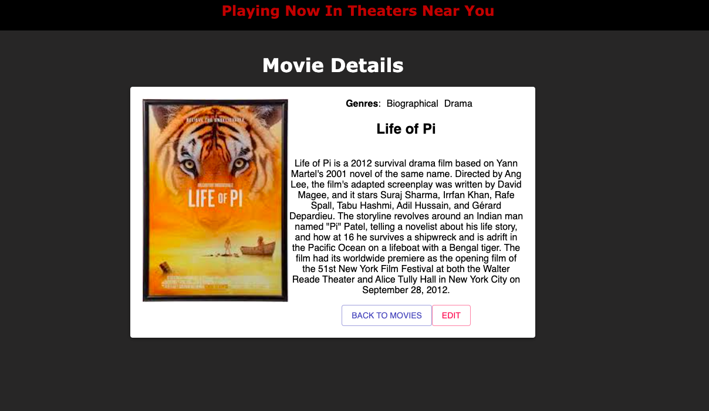
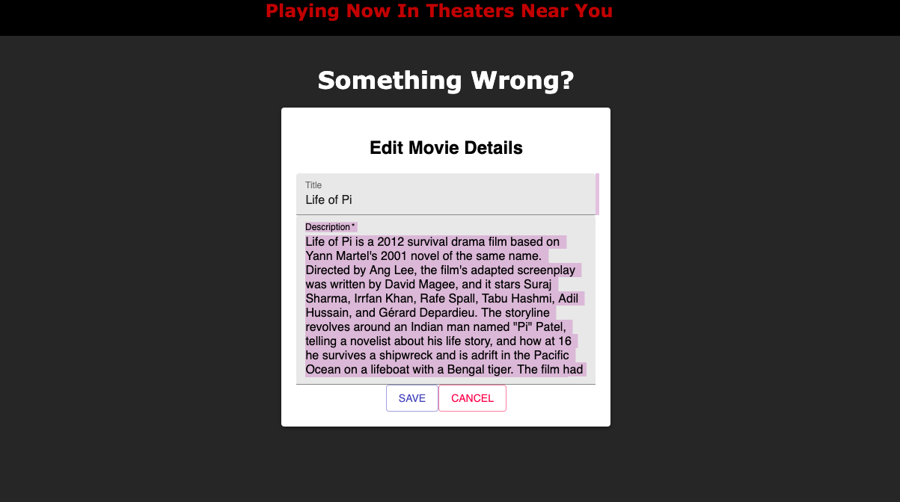
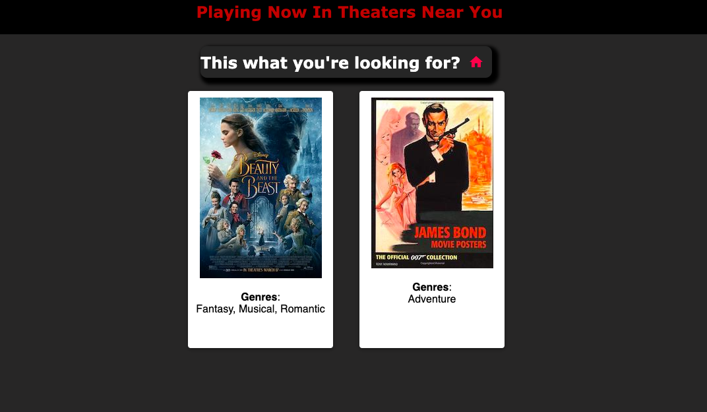

# Project Name

Movie Sagas

## Screenshots

## PRE REQUISITES 

Node.js (https://nodejs.org/en/)
PostgreSQL(https://www.postgresql.org/)
Postico For easy DB interactions (https://eggerapps.at/postico/)

## Installation
1. Create a database named `saga_movies_weekend`
2. Run the queries from `database.sql` on the `saga_movies_weekend` database.

-The queries in the data.sql file are set up to create all the necessary tables and populate the needed data to allow the application to run correctly. The project is built on Postgres, so you will need to make sure to have that installed. We recommend using Postico to run those queries as that was used to create the queries(as recommended above),

-Open up your editor of choice and run  `npm install`

-Run `npm run server` in your terminal
-Run `npm run client` in your terminal
-The npm run client command will open up a new browser tab for you!

## USAGE

I was asked to create a mock movie website to best display the movies that were running at the theoretical theatre. I decided upon a simple yet intuitive designed base where the movies were displayed neatly on the main page with minimal information to clutter the page. Upon clicking a movie it will bring you to a details page specifically for the movie clicked. Further I've created an edit page where one can edit the information for the movie being inspected as well. All information will be retained upon refresh for each page as I utilized localstorage in tandem with reduxstate to carry over the pertinent information.

## Technologies 
 React, jsx, redux, react-redux, react-router-dom, express, pg, pool, axios, and Material-ui. 

 ## Acknowledgement
I want to thank my instructors Casie, Kris, and Edan for providing me the tools to learn. Also big thanks to my classmates for being a source of motivation as we all strive to better ourselves by learning to code.